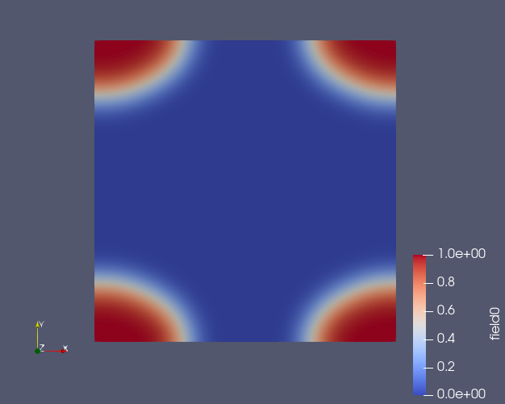
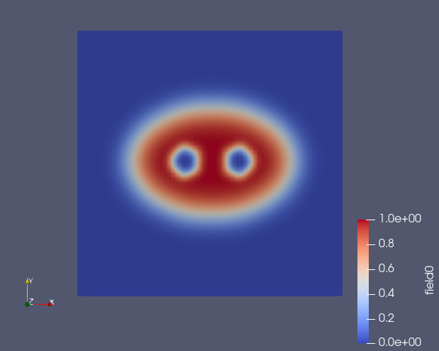

Adding an ellipse to an existing field
======================================

.. automodule:: fieldkit.field_initialize
   :members: add_ellipse
   :undoc-members:
   :show-inheritance:

Example
-------

This examples shows how to add one of more ellipses in 1D/2D.::

   #2d one ellipse
   npw = (64,64)
   field = fk.Field(npw_Nd=npw)
   fk.write_to_VTK("field.vtk", [field])
   fk.add_ellipse(field,center=(0.0,0.0), axis_lengths=(0.3,0.2),height=1)
   fk.write_to_VTK("field_one_ellipse.vtk",[field])

   # 2d multiple ellipse
   npw = (64,64)
   field = fk.Field(npw_Nd=npw)
   fk.add_ellipse(field,center=(0.5,0.5), axis_lengths=(0.3,0.2),height=1)
   fk.add_ellipse(field,center=(0.4,0.5), axis_lengths=(0.05,0.05),height=-1,smoothing_width=0.02)
   fk.add_ellipse(field,center=(0.6,0.5), axis_lengths=(0.05,0.05),height=-1,smoothing_width=0.02)
   fk.write_to_VTK("field_multi_ellipse.vtk",[field])

**Output**
From the example code above, three VTK files are outputted and plotted below in Paraview - field.vtk (left), field_one_ellipse (middle), and field_multi_ellipse.vtk (right).

..  image:: field_no_ellipse.png
   :width: 200
   :alt: field with no ellipse

