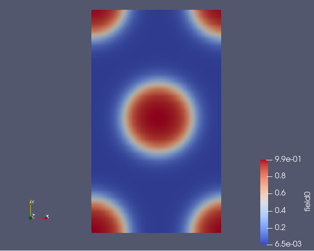
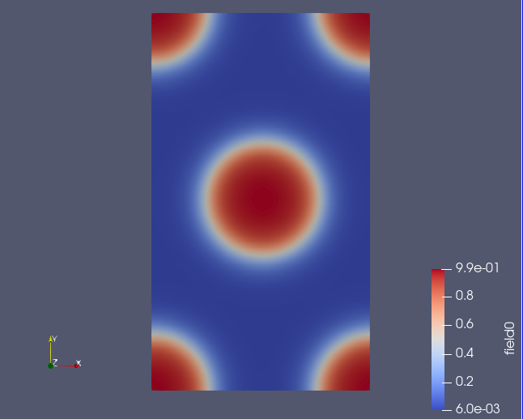
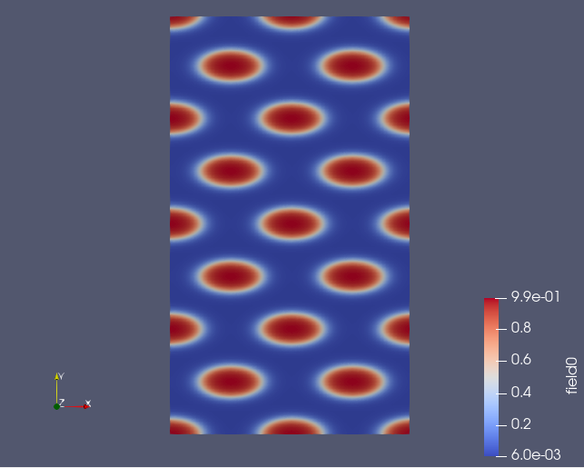

Changing the resolution of a field
==================================

.. automodule:: fieldkit.field_manip
   :members: change_resolution
   :undoc-members:
   :show-inheritance:

Example
-------

This example shows how to change the resolution of an existing field. ::

   import numpy as np

   filename = "density.dat"
   fields = read_from_file(filename)
   fk.write_to_VTK("field.vtk", fields)

   field_new = fk.change_resolution(fields, (64,64))
   fk.write_to_VTK("res_64.vtk", field_new)

   field_new = fk.replicate_fields(fields, (2,4))
   fk.write_to_VTK("res_2_4.vtk", field_new)

**Output**

The following example outputs three 2D VTK files - field with resolution of (32,32), field with resolution of (64,64), and field with resolution of (2,4) 

