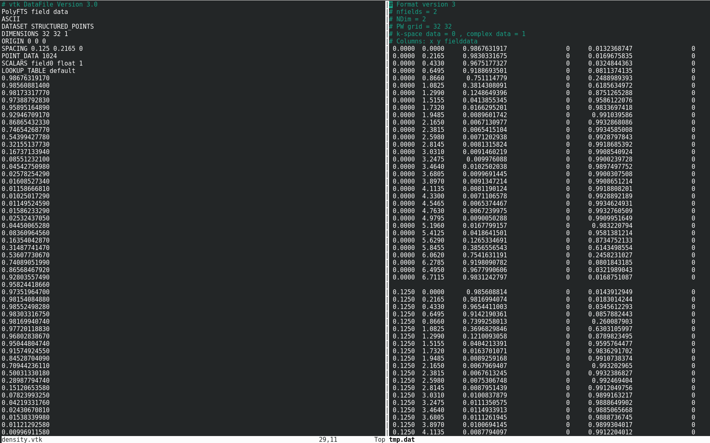

Creating a Field
================

Field class
-----------

.. automodule:: fieldkit.field
   :members:
   :undoc-members:
   :show-inheritance:
   :noindex:

Reading and Writing Functions
-----------------------------
All functions are found in field_io.py

.. automodule:: fieldkit.fileio
   :members: read_from_file, write_to_file, write_to_VTK
   :undoc-members:
   :show-inheritance:
   :noindex:

Example
-------
Uses all three functions from above to create a Field object from density.dat and create dat and VTK files for the Field object::

   import fieldkit as fk

   filename = "density.dat"

   fields = fk.read_from_file(filename)
   fk.write_to_file("tmp.dat", fields)
   fk.write_to_VTK("density.vtk", fields)

**Output**

density.vtk (left) and tmp.dat(right) are the putput files of write_to_VTK and write_to_file functions, respeictively
