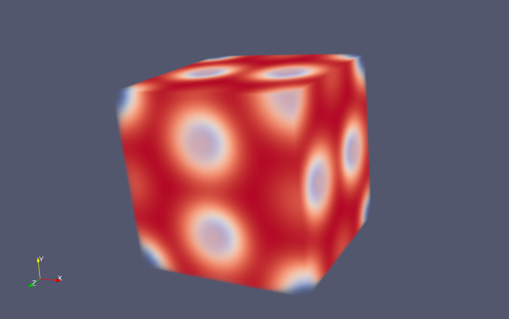
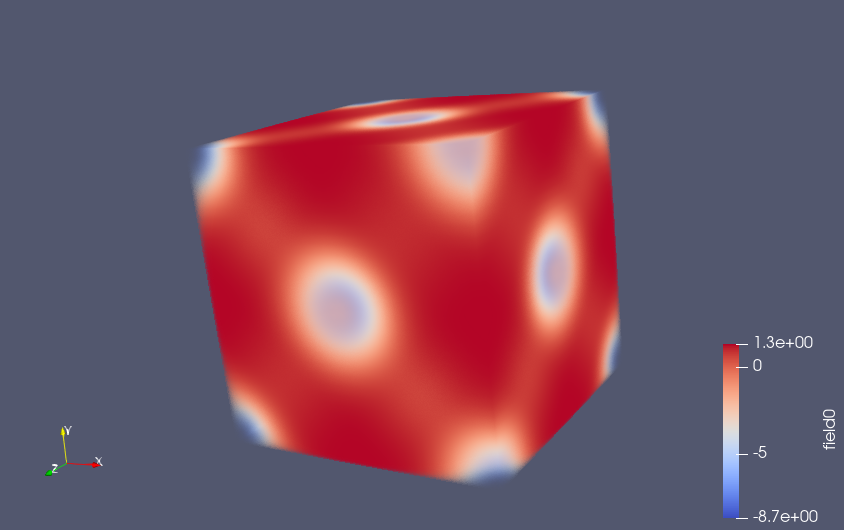

Initializing 3D Phases with 2 or 3 species
==========================================

.. automodule:: fieldkit.initialize
   :members: initialize_phase
   :undoc-members:
   :show-inheritance:
   :noindex:

Example
-------

The following example outputs vtk files for Field objects created by the initialize_phase function.::

   import numpy as np

   #parameters
   npw = (32,32,32)
   h = np.eye(3) * 2

   field = fk.initialize_phase("A15", npw, h)
   fk.write_to_VTK("A15.vtk", field)

   new_field = fk.initialize_phase("alt-C15", npw, h)
   fk.write_to_VTK("alt-C15.vtk", new_field)

**Output**

Data from A15.vtk plotted in Paraview

Data from alt-C15.vtk plotted in Paraview

