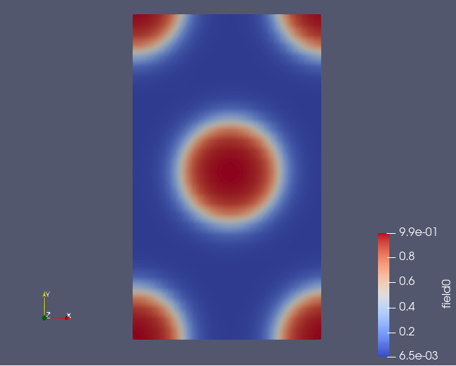
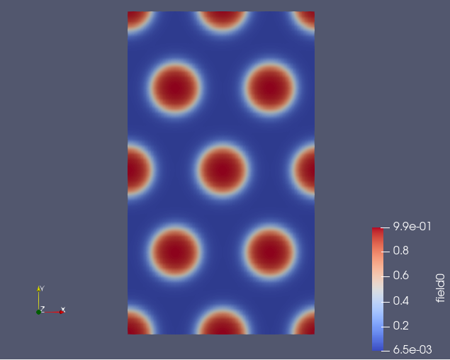
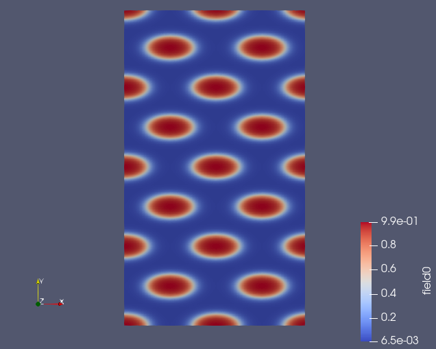

Replicating Fields
==================

.. automodule:: fieldkit.manipulate
   :members: replicate_fields
   :undoc-members:
   :show-inheritance:
   :noindex:

Example
-------

This example shows how to replicate a field by a number of replicates ::

   import numpy as np

   filename = "density.dat"
   fields = read_from_file(filename)
   fk.write_to_VTK("field.vtk", fields)

   field_new = fk.replicate_fields(fields, (2,2))
   fk.write_to_VTK("rep_2_2.vtk", field_new)

   field_new = fk.replicate_fields(fields, (2,4))
   fk.write_to_VTK("rep_2_4.vtk", field_new)

**Output**

The following example outputs three 2D VTK files - field with resolution of (32,32), field replicated by (2,2), and field replicated by (2,4)

