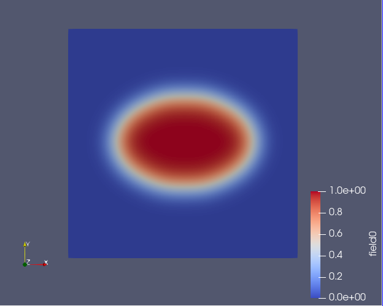
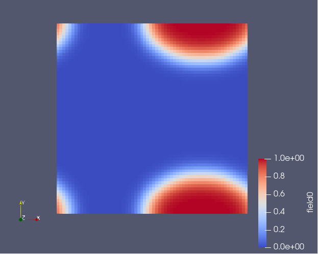

Rolling Fields
==================================

.. automodule:: fieldkit.manipulate
   :members: roll
   :undoc-members:
   :show-inheritance:
   :noindex:

Example
-------
::

   npw = (64,64)
   field = fk.Field(npw_Nd=npw)
   fk.add_ellipse(field,center=(0.5,0.5), axis_lengths=(0.3,0.2),height=1)
   fk.write_to_VTK("fields_init.vtk",[field])
   fields_new = fk.roll([field],shift=(0.25,0.5))
   fk.write_to_VTK("fields_roll.vtk",fields_new)

**Output**

Before using the roll function (left) and after using the roll function (right)

